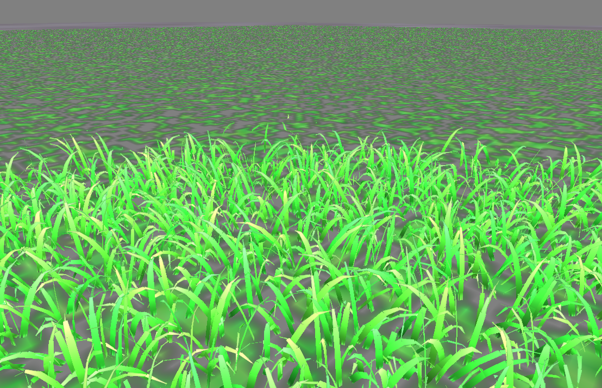

rendering grass in C

dependencies

* glfw for window framework https://www.glfw.org/
* sokol for rendering https://github.com/floooh/sokol
* ctl for comtainers https://rurban.github.io/ctl/
* cglm for math https://github.com/recp/cglm
* stb_image for image loading https://github.com/nothings/stb 

