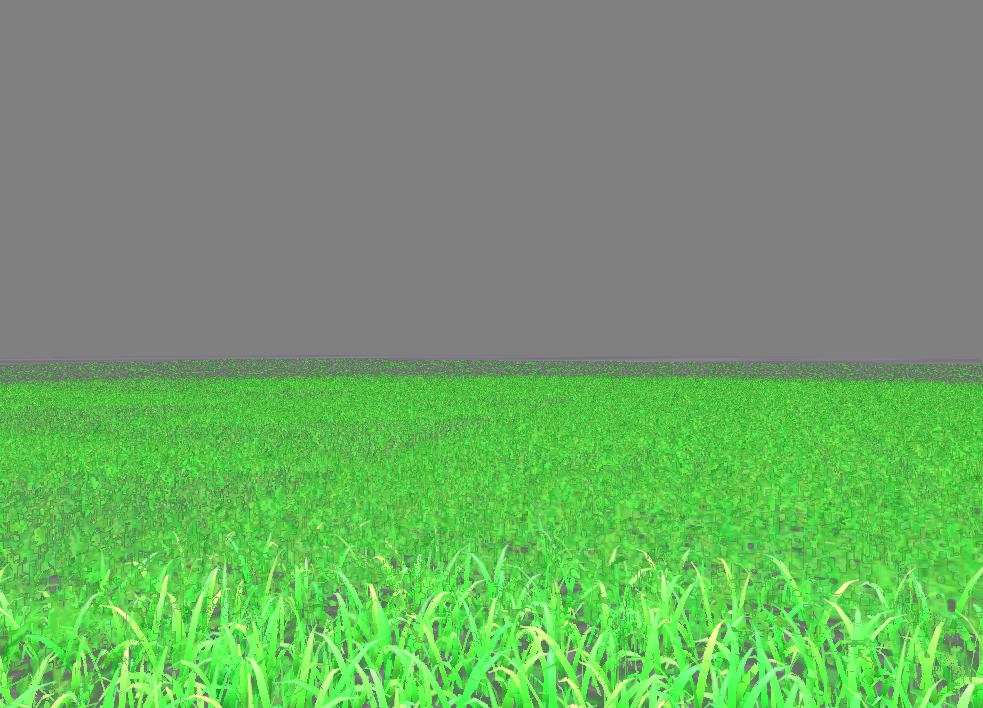

rendering grass in C

* based on https://hal.inria.fr/inria-00087776/PDF/RR-5960.pdf
Kadi Bouatouch, Kévin Boulanger, Sumanta Pattanaik. Rendering Grass in Real Time with Dynamic
Light Sources. [Research Report] RR-5960, INRIA. 2006, pp.36. ffinria-00087776v2 

dependencies

* glfw for window framework https://www.glfw.org/
* sokol for rendering https://github.com/floooh/sokol
* ctl for comtainers https://rurban.github.io/ctl/
* cglm for math https://github.com/recp/cglm
* stb_image for image loading https://github.com/nothings/stb 

